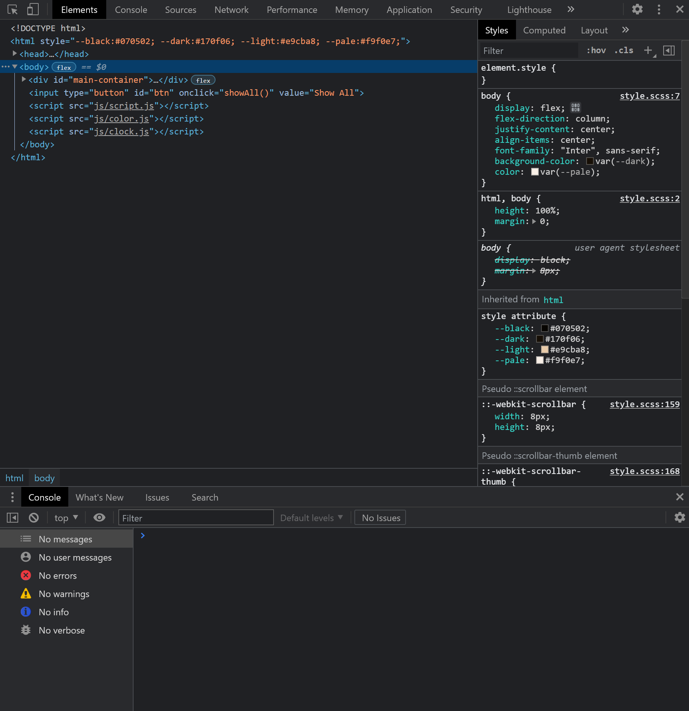
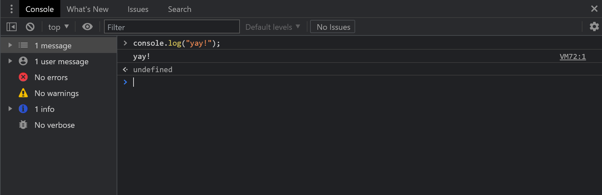
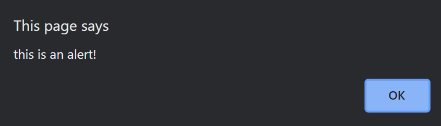

# JavaScript

Welcome to today's lecture notes on JavaScript, presented by Anna Hsu, Co-President of TJ Dev Club. Feel free to follow along with the presentation [here](https://docs.google.com/presentation/d/1gUHlOFa1NPGd8qiSQgYuJSsCsvfzD8bGPbQRmaNEdpc/edit?usp=sharing).

## Introduction

Without further ado, let's get started on the basics of JavaScript!

Disclaimer: we are not intending to teach you the whole JavaScript language in a few hours worth of lecture blocks, since that isn't possible. We'll be covering the basics and everything we think is critical for writing basic websites.

### What is JavaScript?

First, let's discuss what [JavaScript](https://developer.mozilla.org/en-US/docs/Learn/JavaScript/First_steps/What_is_JavaScript) is. For short, we often call it "JS", since we're lazy and we like abbreviations. Contrary to what its name suggests, it is not related to the other computer programming language Java. That story is a little complicated, so we won't get into it today, although you might recognize some similarities between the two simply because they're both relatively object oriented. It's a scripting and programming language, meaning that it's a programming language that's interpreted at runtime (when it runs), like Python, instead of compiled like, Java and C. It's rapidly increased in popularity since its release in 1995, and many frameworks which we'll learn about are based on JS.

You can run JS on a server; an example of this would be using Node.js, which we'll be covering later this year. For now, we'll be focusing on using the web browser to run JS code.

### HTML, CSS, and JS

You'll soon discover that JS is very powerful when writing websites because of its speed and the features it adds. While HTML is designed to create content and CSS is designed to present that content to the user in a way that makes sense and is aesthetically pleasing, JS does something a little different. It manipulates the content and provides dynamic and interactive components to users. Together, these three languages comprise basic web development.

### Where do you write JS?

We'll be using JS alongside HTML and CSS on our websites. You might recall that there are two ways to write CSS: inline with the `<style>` tag, or linking to an external stylesheet with `<link>`. Similarly, in JS, there are two ways to insert JS. However, both use the `<script>` tag. Inline JS puts the code right between the tags, whereas when linking externally you'd use the `src` attribute to show its location relative to your current file. This is similar to the `href` attribute when linking stylesheets.

```html
<script>
  // this is what internal (inline) JS looks like. this is a comment!
  console.log("Hello, world!");
</script>
<!--> below is an example of linking to an external stylesheet <--->
<script src="main.js"></script>
```

For the rest of this lecture, we'll be showing code examples as if we were in a JS file, unless otherwise stated.

### Console

There are a variety of ways to access the console in your web browser. 

- right click, "Inspect"
- Ctrl + Shift + I
- Ctrl + Shift + C
- F12

You can access the console at the bottom of the screen or on the console tab at the top. This is one way you can run your JS code!



You can input JS straight into the console, and among these commands are `console.log()` and `alert()`. `console.log()` is JS's version of print statements (_logging_ to the _console_), and it takes any data type that you want it to log. We'll go over data types later in this lecture, but for now, just remember to encapsulate any alphabetical text in quotes.



Alerts work similarly in that you put what you want to display in the alert within the parentheses of the `alert()` command. When you hit enter, it will show up at the top and center of your screen!



Prompts are alerts that ask for something from the user. You can store this information in a variable, which we'll talk about later in the lecture. Otherwise, it will return a string with what the user inputs.


### Comments

Comments are a tool that many programmers and developers use when writing code, since it explains code that might be hard to understand or you can temporarily remove code without deleting when you're debugging, since they're ignored by the interpreter. There are two ways to do comments: single-line and multi-line.

```js
// this is a single-line comment
/* this is a multi-line comment except it's only one line here */
```

### Semicolons

Let's talk about [semicolons in JS](https://www.freecodecamp.org/news/lets-talk-about-semicolons-in-javascript-f1fe08ab4e53/) briefly. They're optional, since JS uses Automatic Semicolon Insertion to put them in behind the scenes for you. This can be both a blessing and a curse, because while your code won't break if you forget a semicolon, it can sometimes have unintended consequences. It's up to you, the developer, to choose what works for you.

## Variables
Let's jump into variables, which are the heart of JS.

### What is a variable? 

Similar to math class, a variable will store data. You can assign a variable by using the `const` and `let` keywords, which are new in ES6, the latest version of JS. In ES5 and earlier, we would use the `var` keyword. The change comes so variables are no longer globally scoped, which means they'll only be valid within the block they're defined, rather than the whole file. The difference between `const` and `let` is that the former cannot be altered, while the latter can be. Some developers like using `const` for all variables unless they know they have to be changed, just for simplicity.

Since JS is loosely or dynamically typed, you don't have to declare the data type of the variable, unlike languages such as Java. You can even change the type of your variable later! There are 8 data types in JS: Number, BigInt, String, Boolean, null, undefined, Function, Object, and Symbol. Technically, functions are a type (since it responds to typeof), but we'll exclude them here.

- Number: numbers between -(2^53 − 1) and 2^53 − 1
- BigInt: really big numbers that react to math in strange ways
- String: text
- Boolean: true/false
- null: the state of being empty
- undefined: variables that haven't been assigned a value
- Object: an entity with a collection of properties
- Symbol: confusing irrelevant stuff

When you name your variables, make sure to lowercase the first letter and uppercase the first letter of all subsequent words. This is JS convention and it is known as **camel case**. Try to be as descriptive as possible when naming variables, so you'll know what you come back to and others can understand your code!

### Declaration, Initialization, and Assignment

Before a variable can be assigned a value, the computer has to know that it exists. You can declare a variable with the `const` or `let` keyword and the name of the variable. In order for the variable to have a value, it needs to be initialized with `=` and given a value with the data type of your choice. 

```js
const name;
name = "Anna";
```

When you know the value of the variable at declaration, you can do all three steps in one line.

```js
const name = "Anna;
```

Note: do not initialize and assign values if the variable has not been declared. 

If you'd like to declare multiple variables at once, you can use a shorthand.

```js
const x = 3, y = 4, z = 5;
/* this is equal to
const x = 3;
const y = 4;
const z = 5;
/*
```

### Math

One of the simplest things you can do with JS is math. That's what computers are good at! You can do math with both numbers and variables (assuming the variable has a data type of a number). The operations that are covered in JS include typical arithmetic with addition, subtraction, multiplication, and division, as well as the modulus operation. Modulus might seem new, but it's just the remainder when you divide something. For example, if you declare `x` and `y` with `const` equal to 3 and 11 respectively, when you take `y % x`, the value will be 2, since the remainder of 11 / 3 is equal to 2.

Note: PEMDAS (order of operations) applies in JS math, as well as all other programming languages.

You can do math the traditional way (e.g., `x + y`), but there are also some handy operators you can use. The increment (`++`) and decrement (`--`) operators, otherwise known as examples of unary operators (operation with only one operand), are helpful for quick addition or subtraction by 1. There are also addition, subtraction, multiplication, division, and modulus assignment operators, which do the selected operation but also assign the value after the operation to its variable.

### Strings
When you're manipulating strings, you'll often have to join two strings together. This process is called **concatenation**. There are two good ways that you can concatenate in JS: the plus operator and template strings. There are a few other ways that you can concatenate, but for beginners, we won't recommend them here. Using the plus operator, you're just directly combining two strings in probably the most intuitive way. With template strings, you use backticks (\`) instead of quotes, and in the place of your variable, you surround it with brackets (`{}`) and put a dollar sign in front of it. It's easier to see the surroundings of your variable in template strings, helping code readability.

There's a lot more  on strings, but we won't get into it for the sake of this introduction.

```js
const name = "Anna";
console.log("Hi my name is " + name + ".");
console.log(`Hi my name is ${name}.`);
```

## Logic
Logic is how circuitry runs, and since we're effectively telling circuitry to run, we have to understand how to write such code.

### Boolean
We briefly mentioned data types earlier, but when we're discussing code logic, we'll focus on one data type in particular: booleans&mdash;a data type with values of `true` or `false`. You’ve probably heard that computers understand 0s and 1s, and booleans can be represented that way, with `true` being 1 and `false` being 0. You can compare two values of any data type using `==` and `===`, and a boolean value will be returned. One thing to note is that `===` considers data type in its comparison while `==` does not, meaning that if the values are the same but the data types are not, the comparison will return `false`. You can also compare values that are greater than (`>`), less than (`<`), greater than or equal to (`>=`), and less than or equal to (`<=`).

```js
const x = 13;
console.log(x == "13"); // prints true
console.log(x === 13.0); // prints true
console.log(x === "13"); // prints false
console.log(x == 15); // prints false
```

### Conditionals
One way booleans come in handy would be conditions. These are statements that run when conditions are met but are bypassed when not. Within the parentheses of the `if` and `else if` statements is where the conditions are evaluated, and based on whether they return `true` or `false`, the code within the blocks will decide if they’re supposed to run. You can compare values like we previously mentioned.

```js
const x = 2;
if (x > 2) {
	console.log("x is greater than 2");
} else if (x < 2) {
	console.log("x is less than 2");
} else {
	console.log("x is equal to 2");
}
```

### Boolean Algebra
Alternatively, you can also string together different operations such as not, and, and or. This is called boolean algebra, and this is where the binary representation of booleans comes in handy.

- `!` means that the value of the boolean is inverted
- both conditions being evaluated must be `true` in order for `&&` to return `true`
- only one condition being evaluated has to return `true` in order for `||` to return `true`


## Loops
What if you have to repeat a task a lot? Let's find more efficient ways to write code.

### What is a loop and why should you use one?
A loop is a block of code that runs repeatedly based on some constraints. It's easier for humans to understand, more efficient, and less error prone, which are some of the reasons why developers use it over copy pasting code. Imagine if you had to change one line in your loop, but you had copy pasted it hundreds of times already! Loops can help you save a lot of time.

### While Loop
While loops are one of the simplest loops out there. They evaluate a condition, and if it is `true`, it runs the block of code. For as long as the condition is `true`, it will keep running. Once it becomes `false`, it stops.

```js
let x = 3, y = 8;
while (x + y > 4) {
	console.log(x + y);
	x-=2;
	y++;
}
```

### Do...While Loop
Do...while loops are similar to while loops in that they keep executing while a condition evaluates to `true`. However, do...while loops always run at least once, since it checks the condition at the end. Typically, do...while loops are less common, though.

```js
let condition = false;
do {
	console.log("uwu");
} while (condition);
```

### For Loop
For loops are a shorthand for cycling through statements a set number of times. With while loops, you don’t know how many times a block of code needs to run before the condition evaluates to false, but with for loops, you set the number of times it will run. When the value of your counter variable has exceeded the condition you set, it will stop running.

```js
for (let day = 1; day < 31; day++) {
	console.log("Today is November " + day);
}
```

## Functions
So far, most of what you've learned has been similar to languages like Java. However, with functions, this is where things start getting very different.

### What is a function?
Functions are reusable chunks of code that take in an input to create an output. They're similar to methods, although functions are not associated with objects like methods are. When you want to use a function to accomplish a task, you'll start by **defining** the function: saying it exists and what it should do. Then, you'll **call** (or **invoke**) the function so the code will execute with whatever arguments you're provided. Lastly, after the function is done **executing**, it’ll **return** a value. Sometimes it’s not a useful return value, like `null` or `undefined`, but it’s how the function stops executing.

### Function Declaration
There are two types of ways you can declare a function. The first would be through function declaration (seems obvious enough, no?). Function declaration always starts with the function keyword, followed by the name of the function, any arguments in parentheses, and code within curly braces.

To call the function, simply type the name of the function and put the arguments in parentheses.

Note: if you don't have arguments, just don't leave anything between the parentheses.

```js
function printName(name) {
	console.log(`My name is ${name}`);
}
printName("Anna");
```

### Function Expression
Another way to declare a function is through **function expressions**, which are just functions that don't start with the `function` keyword. They're anonymous, meaning that the function technically doesn't have a name (note the lack of a function name after the `function` keyword in the example), although you can reference the function via the name of the variable the function is associated with.

We previously mentioned how functions stop executing when it hits the `return` keyword. We have an example of that here, but not in the previous example. If you don't give an explicit return value, it will automatically return `undefined`.

```js
const printName = function(name) {
	return `My name is ${name}`;
}
```

### Arrow Functions
You can declare function expressions using the function keyword, but you can also use arrow functions. These are a different syntax that was introduced with ES6, and they're a pretty efficient way of declaring a function. The syntax might seem strange at first, but you'll find that it's really convenient and quite easy to read. You'll notice how you don't need parentheses to surround a single argument, and if all of your code is on one line, you don't even need brackets. If you don't have an argument, use an underscore as a placeholder.

In the final `printName()` example, the string in the function is actually its return value, contrary to what we said about functions with no explicit return statements. This is a new ES6 feature that shortens code even more, although make sure you're aware so your code doesn't have unintended side effects.

```js
const printName = name => {
	return `My name is ${name}`;
}
const printName = (name, age) => {
	return `My name is ${name} and I am ${age} years old.`;
}
const printName = name => `My name is ${name}`;
const noArg = _ => console.log("No argument!");
printName("Anna");
```

## Arrays
What's a way to organize lists of data? Arrays get the job done.

### What is an array?
Arrays are lists or groupings of data in JS. They don't have to all be the same data type, since JS is a loosely or dynamically typed language. You can even include arrays in arrays! You can access any item in the array via its index, which is a number that points to its location relative to all other items. JS arrays use 0-indexing, which means that the first element has an index of 0, and they count up until the last element by 1. If you have an array with `n` number of elements, the last index will be `n - 1`. Most programming languages you'll encounter are 0-indexed, but there are [exceptions](https://stackoverflow.com/questions/45483955/are-there-any-programming-languages-in-which-arrays-are-not-zero-indexed). Unlike languages like Java, you can change the size of your array after you create it. We create arrays using **array-literal syntax**, which is just assigning a variable with an array using brackets.

```js
const officers = ["Anna", "Bryant", "Zakariyya", "Daniel", "Allen", "Ashley"];
const members = [];
```

### Accessing & Manipulating Values
Accessing data in arrays is pretty important&mdash;arrays are like homework folders, and by accessing data you're taking out homework assignments and doing something with them. With indices, we know where the data is, similar to how (if you've organized your folder properly) you might know which slot your CS homework is in. With arrays, we use square brackets to call up that data. You can take that data and put it into a variable and then do other things with it. You can also use square bracket notation to change data or append data.

Wait, but I thought `officers` was a `const`? Why are you able to change its values? As it turns out, only the variable assignment is constant, and the values of the array remain mutable. This means that `officers = ["Akash", "Alex", "Anna", "Gayatri", "Kari", "Bryant"]` won't work, but just changing individual slots is ok.

```js
const publicist = officers[5]; // "Ashley"
officers[0] = "Uhnoo";
officers[6] = "Panda";
```

We can find out how many elements are in an array by using the `length` property. (Note how it isn't a method, and thus the lack of parentheses.) This will become super helpful when you need to know the number of elements your array has.

```js
console.log(officers.length); // 6
console.log(members.length); // 0
```

### Array Methods
There are a lot of array methods that come shipped with JS. The first four we are going over are `push()`, `pop()`, `shift()`, and `unshift()`. 

`push()` adds an element to the end of an array, taking an argument with the data value you want to add. `pop()` removes the last element of the array. `shift()` is like `pop()` and `unshift()` is like `push()` but at the front of the array instead of at the end. Both `pop()` and `shift()` return the value that they remove, while `push()` and `unshift()` return the length of the array. This can be stored in a variable or used for other manipulation.

```js
officers.push("Alex");
officers.pop(); // oh wait, he graduated

officers.shift();
officers.unshift("Anna"); // oops, she's pretty important, right?
```

What if you want to remove an element from the middle of an array? `splice()` allows you to remove items starting from an index and for however many elements that come after you want to remove, non-inclusive. The removed items are then returned in an array. `slice()` makes a copy of the array. `sort()` compares all of the array elements and puts them in ascending UTF-16 code values, assuming everything is a string. (Special characters come first, then numbers, then capital letters, then lowercase numbers.) This actually changes the array, so if you want to maintain the previously unsorted array, make sure to use `slice()` to make a copy first. Lastly, `indexOf()` finds and returns the index where a piece of data is located. If it's not in the array, it will return `-1`.

```js
const panda = officers.splice(6, 1); // removes 1 item from index 6 
const officersClone = officers.slice();
officers.sort();
console.log(officers.indexOf("Uhnoo")); // -1
console.log(officers.indexOf("Anna")); // 1
```

### Array Iteration
JS gives you a lot of ways to search through all of the indices of an array and possibly modify them. We call this **array iteration**.

One of the most common ways of iterating through an array is through a for loop. It starts from the 0 index to the `n - 1` index and applies the manipulation or modification to every element.

```js
for (let i = 0; i < officers.length; i++) {
	console.log(`${officers[i]} is an officer at Dev Club!`);
}
```

For...of is used when iterating over all iterables such as arrays, strings, sets, and maps. It first checks to make sure an element is iterable, and then does the same thing as a for loop. This was introduced in ES6, making a faster option for your code.

```js
for (const officer of officers) {
	console.log(`${officer} is an officer at Dev Club!`);
}
```

However, JS also gives us two extra methods that can allow us to iterate over arrays: `forEach()` and `map()`. Both methods take a function as a parameter and modify all elements in an array. However, `forEach()` returns `undefined`, whereas `map()` returns the new modified array. `map()` is also chainable, meaning that you can apply other methods to the array afterwards. You can't do this with `forEach()` because it returns `undefined`. You can find some other differences here.

Which one should you choose? If you need the new array, use `map()`, but if you don't, `forEach()` might be faster.

```js
officers.forEach(officer => console.log(`${officer} is an officer at Dev Club`));
officers.map(officer => console.log(`${officer} is an officer at Dev Club`));
```

## Other Important Things

Since we don't have a lot of time to cover JS, we encourage you to explore some more resources we'll share on the next slide. Some things you might want to dive deeper into are more on strings and arrays, promises, and objects. They'll be incredibly helpful in your understanding of JS and JS based frameworks such as React!

## Additional Resources

- [FreeCodeCamp](https://www.freecodecamp.org/learn/javascript-algorithms-and-data-structures/)

## Any questions? Feedback?
Congrats on making it this far! Let me know if you have any questions about anything we've covered in this presentation, and don't hesitate to reach out if you have any feedback!